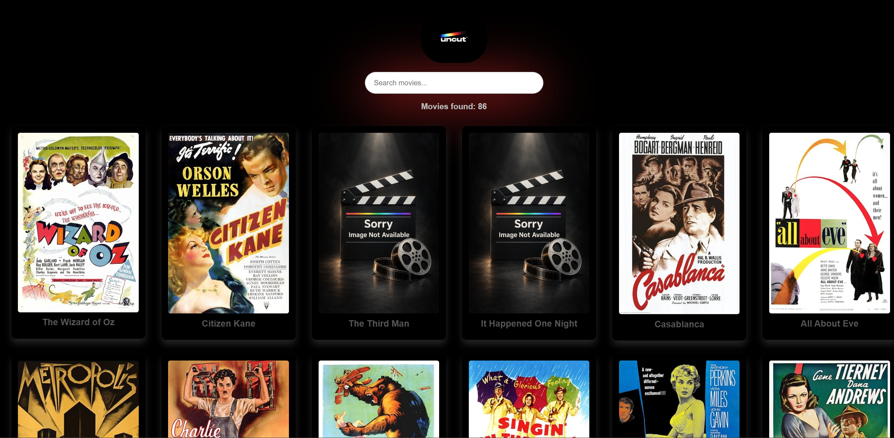

# Uncut Movie Search

Uncut is a responsive movie search application built with React. It fetches a collection of classic movies from a public API and allows users to search for movies by title as they type.

## Preview

## Features

- Fetches live movie data from a public API
- Displays movie titles and posters
- Searches movies by title
- Updates search results while the user types
- Shows the total number of matching movies
- Displays a loading message while fetching data
- Displays an error message if the request fails
- Shows a message when no movies match the search
- Uses a placeholder poster when a movie image cannot load
- Includes a responsive layout for different screen sizes
- Includes card hover effects and a custom gradient design

## Technologies Used

- React
- JavaScript
- CSS
- React Bootstrap
- Vite
- Sample APIs

## API

Movie data is provided by [Sample APIs - Classic Movies](https://api.sampleapis.com/movies/classic).
